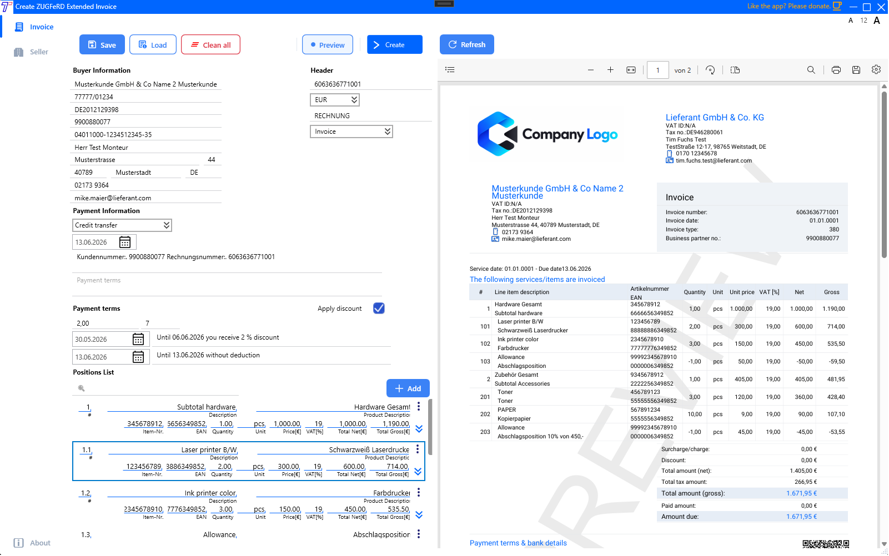

# Tulo.eInvoiceCreatorZUGFeRD

🇬🇧 English version: [README_EN.md](README_EN.md)

> Eine Open-Source, professionelle WPF-Desktopanwendung zum Erstellen, Anzeigen, Archivieren und digitalen Signieren
> vollständig konformer elektronischer Rechnungen im Format **ZUGFeRD 2.4 EXTENDED / Factur-X 1.0** — entwickelt auf Basis von **.NET 8**,
> für den realen geschäftlichen Einsatz konzipiert und ohne Installer lauffähig.

  

 

[📄 Beispiel-PDF-Rechnung — 6063636771001.pdf](./ReadMeAsserts/6063636771001.pdf)

[📄 Beispiel-XML-Rechnung — 6063636771001.xml](./ReadMeAsserts/6063636771001.xml)

[📄 Beispiel-Pdf/A3-Rechnung — 6063636771001_PdfA3.pdf](./ReadMeAsserts/6063636771001_PdfA3.pdf)

[📄 Beispiel-signierte Pdf/A3-Rechnung — 6063636771001_SignedPdfA3.pdf](./ReadMeAsserts/6063636771001_SignedPdfA3.pdf)

---

## Was diese Anwendung macht

`Tulo.eInvoiceCreatorZUGFeRD` ist ein vollständiges Werkzeug zur Rechnungserstellung, das weit über die einfache Anzeige von XML hinausgeht.

Es ermöglicht Anwendern, alle relevanten Rechnungsdaten einzugeben — Verkäufer, Käufer, Positionen, Zahlungsbedingungen,
Skonti — und erzeugt ein vollständiges, **ZUGFeRD 2.4 EXTENDED / Factur-X 1.0**-konformes Dokumentenpaket:
CII-XML, PDF, PDF/A, PDF/A-3 mit eingebettetem XML sowie optional ein digital signiertes PDF.

Die Anwendung ist auf das Profil **ZUGFeRD 2.4 EXTENDED** ausgerichtet.
Andere Profile werden nicht aktiv getestet und sind nicht das eigentliche Ziel dieses Projekts.

Der Nutzer behält jederzeit die volle Kontrolle über seine Daten.
Verkäuferinformationen, Käuferdaten und alle Rechnungsinhalte werden lokal verwaltet —
nichts wird an einen externen Dienst gesendet.

---

## Wichtiger Haftungsausschluss

Bitte lies die im Programm verfügbare Haftungsausschluss-Information, bevor du die Anwendung
in einem produktiven, rechtlichen oder compliance-relevanten Kontext verwendest.

Du findest sie unter:

**Ansicht → Über**

---

## Voraussetzungen

| Voraussetzung | Detail |
|---|---|
| Betriebssystem | Windows x64 |
| Runtime | .NET 8 (muss separat installiert werden) |
| .NET Download | https://dotnet.microsoft.com/en-us/download/dotnet/8.0 |

---

## Erste Schritte

1. Gehe auf die Seite [Releases](../../releases)
2. Lade die neueste `.zip`-Datei herunter
3. Erstelle eine Ordnerstruktur wie im Abschnitt [Konfiguration — Endanwender](#konfiguration--endanwender) beschrieben
4. Entpacke die ZIP-Datei in den Ordner `Tulo.eInvoiceCreatorZUGFeRD/`
5. Bearbeite deine `appsettings.json` im Ordner `Tulo.eInvoiceCreatorZUGFeRD-appsettings/` mit deinen Verkäuferdaten und Einstellungen
6. Starte `Tulo.eInvoiceCreatorZUGFeRD.exe`

Kein Installer erforderlich.

---

## Validierung

Nach dem Erzeugen einer Rechnung wird die Validierung mit offiziellen Werkzeugen dringend empfohlen:

- **[Kosit Validator](https://github.com/itplr-kosit/validator)**
- ⭐ **[Online ZUGFeRD Validator](https://www.portinvoice.com/en/)**

---

## Unterstützte Rechnungsstandards

| Standard | Details |
|---|---|
| **ZUGFeRD 2.4 EXTENDED** | Hauptziel — vollständig unterstützt und getestet |
| **Factur-X 1.0 EXTENDED** | Französisches/europäisches Äquivalent — vollständig unterstützt und getestet |
| **CII** | Cross Industry Invoice (UN/CEFACT) — wird als zugrunde liegendes Datenformat verwendet |
| **PDF/A-3** | Teil 3, Konformitätsstufe B — Archiv-PDF mit eingebettetem XML |
| **XRechnung SubLine EXTENDED** | unterstützt |

> **Hinweis:** Andere ZUGFeRD-Profile (MINIMUM, BASIC WL, BASIC, EN16931) werden nicht aktiv
> getestet. Sie könnten funktionieren, sind jedoch nicht garantiert. Der Fokus dieser Anwendung liegt auf
> **ZUGFeRD 2.4 EXTENDED**.

---

## Rechnungsdaten — was du ausfüllen kannst

### Kopfbereich

| Feld | Beschreibung |
|---|---|
| Rechnungsnummer | Eindeutige Dokumentkennung |
| Währung | z. B. EUR |
| Dokumentname | Frei wählbarer Dokumentname |
| Dokumenttyp-Code | 380 Rechnung / 381 Gutschrift / 383 Lastschriftanzeige |

### Käuferpartei

| Feld | Beschreibung |
|---|---|
| Firmenname | Rechtlicher Name des Käufers |
| Steuernummer | Steuerliche Registrierungsnummer |
| USt-IdNr. | Umsatzsteuer-Identifikationsnummer |
| ERP-Kundennummer | Interne Kundenreferenz |
| Leitweg-ID | Deutsche Routing-ID für den öffentlichen Sektor |
| Ansprechpartner | Name des Kontakts beim Käufer |
| Straße / Hausnummer | Adresse |
| Postleitzahl / Ort / Land | Adresse |
| Telefon / E-Mail | Kontaktdaten |

> 💾 Käuferdaten können als **JSON gespeichert und geladen** werden — keine erneute Eingabe bei jeder Rechnung nötig.

### Zahlungsinformationen

| Feld | Beschreibung |
|---|---|
| Zahlungsart-Code | 58 Überweisung / 59 SEPA / 49 Lastschrift / 10 Barzahlung / 48 Karte |
| Zahlungsreferenz | z. B. Rechnung + Kundennummer |
| Zahlungsbedingungen | Freitextbedingungen |
| Fälligkeitsdatum | Datum, bis zu dem die Zahlung erwartet wird |

### Zahlungsbedingungen — Skonto

| Feld | Beschreibung |
|---|---|
| Skonto % | Skonto-Prozentsatz bei früher Zahlung |
| Skontotage | Anzahl der Tage, in denen Skonto gültig ist |
| Skonto-Basisdatum | Startdatum für den Skontozeitraum |

### Rechnungspositionen

Jede Position enthält:

| Feld | Beschreibung |
|---|---|
| Positions-Nr. | Automatisch verwaltete Zeilennummer |
| Beschreibung | Hauptbeschreibung der Position |
| Produktbeschreibung | Zusätzliche Produktdetails |
| Artikel-Nr. / EAN | Artikelnummer des Verkäufers und Barcode |
| Menge / Einheit | Menge und Maßeinheit (UN/ECE) |
| Einzelpreis | Nettopreis pro Einheit |
| MwSt.-Satz / MwSt.-Kategorie | Steuersatz und Kategoriecode |
| Rabatt | Rabattbetrag auf Positionsebene und Grund |
| Bestellreferenz | Bestell-ID und Datum |
| Lieferschein | Lieferschein-ID, Datum und Zeilenreferenz |
| Referenzdokument | Externe Dokumentreferenz (z. B. VN / 130) |

### Verkäuferdaten — über appsettings konfiguriert

Verkäuferinformationen werden nicht manuell in der UI eingegeben.
Sie werden in `appsettings.json` vorkonfiguriert und automatisch auf jede Rechnung angewendet.
Siehe den Abschnitt [Verkäuferkonfiguration](#verkäuferkonfiguration) für Details.

---

## Vorschaumodus

Bevor die Dateien endgültig erzeugt werden, kann direkt aus der UI eine Vorschau angefordert werden.

Im Vorschaumodus:
- Die Rechnung wird vollständig im Speicher als PDF gerendert
- Ein **PREVIEW**-Wasserzeichen wird über das Dokument gelegt
- Das Ergebnis wird innerhalb der Anwendung im integrierten PDF-Viewer angezeigt
- **Es werden keine Dateien auf die Festplatte geschrieben**

Dadurch ist eine vollständige visuelle Prüfung von Layout, Daten und Struktur möglich,
bevor das endgültige PDF/A-3 erstellt wird.

---

## Archiv und Ausgabedateien

Wenn die Rechnungserstellung ausgelöst wird, werden die folgenden Dateien in das konfigurierte Ausgabeverzeichnis geschrieben:

| Datei | Beschreibung |
|---|---|
| `{InvoiceNumber}.pdf` | Roh erzeugtes PDF |
| `{InvoiceNumber}.xml` | CII-XML (ZUGFeRD 2.4 EXTENDED) |
| `{InvoiceNumber}_PdfA.pdf` | PDF/A-Zwischenschritt (Archivformat) |
| `{InvoiceNumber}_PdfA3.pdf` | Finales PDF/A-3 mit eingebettetem XML |
| `{InvoiceNumber}_SignedPdfA3.pdf` | Digital signiertes PDF/A-3 (falls konfiguriert) |

Konfiguriere den Ausgabepfad in `appsettings.json`:

```json
"Archive": {
  "OutputPath": "C:\\Invoices\\Output",
  "CanOpenPdfWithDefaultApp": true
}
```

Wenn kein gültiger Pfad konfiguriert ist, wird das Temp-Verzeichnis des Systems als Fallback verwendet. 
Wenn CanOpenPdfWithDefaultApp auf true steht, wird nach der Erstellung automatisch die beste verfügbare Ausgabedatei geöffnet (signiertes PDF wird gegenüber unsigniertem bevorzugt).

---

## Verkäuferkonfiguration

Die Verkäuferdaten werden einmalig in `appsettings.json` definiert und für alle Rechnungen wiederverwendet:

```json
"Invoice": {
  "Seller": {
    "Name": "Your Company Name",
    "Street": "Your Street",
    "Zip": "12345",
    "City": "Your City",
    "CountryCode": "DE",
    "VatId": "DE000000000",
    "FiscalId": "00000/00000",
    "LeitwegId": "",
    "GeneralEmail": "info@yourcompany.com",
    "ContactPersonName": "Your Contact",
    "ContactPhone": "+49 000 0000000",
    "ContactEmail": "contact@yourcompany.com"
  },
  "Payment": {
    "Iban": "DE00000000000000000000",
    "Bic": "YOURBICXXX",
    "AccountName": "Your Company Name"
  },
  "Notes": [
    { "Content": "Your bank info note here", "SubjectCode": "REG" },
    { "Content": "Your general terms note here", "SubjectCode": "AAI" }
  ]
}
```

---

## Digitale Signierung — optional

Die Signierung von PDF/A-3 wird durch das begleitende CLI-Tool tulo.SigningPdfA3.exe ausgeführt.

Die Signierung wird still und ohne Fehler übersprungen, wenn eines der folgenden Elemente fehlt:

    Der Pfad zur Signierungs-EXE (SignedExepath)
    Die Zertifikatsdatei (SignaturePath)
    Das Zertifikatspasswort (PublicKey)

Konfiguration in appsettings.json:
json

"Signature": {
  "SignedExepath": "C:\\Tools\\tulo.SigningPdfA3.exe",
  "SignaturePath": "C:\\Certificates\\your-certificate.pfx",
  "PublicKey": "your-certificate-password",
  "Reason": "Invoice approval",
  "Location": "Germany",
  "ContactInfo": "contact@example.com"
}

Wichtiger Hinweis zu Zertifikaten

Dieses Projekt kann Beispiel- oder Dummy-Konfigurationen für die Signierung enthalten (z. B. Platzhalterpfade oder ein selbstsigniertes Testzertifikat, das während der Entwicklung verwendet wurde).

    Es wird kein produktionsreifes Zertifikat mit diesem Repository ausgeliefert.
    Jedes Beispielzertifikat oder Passwort, das im Code oder in der Konfiguration gezeigt wird, ist ausschließlich für lokale Tests, Demo- oder Forschungszwecke gedacht.
    Für den echten geschäftlichen, rechtlichen oder compliance-relevanten Einsatz musst du ein eigenes geeignetes Zertifikat beschaffen (zum Beispiel von einer vertrauenswürdigen Zertifizierungsstelle oder gemäß deinen lokalen/eIDAS-Anforderungen).

Du bist vollständig verantwortlich für:

    Die Auswahl eines geeigneten Zertifikatstyps und Vertrauensniveaus für deinen Anwendungsfall
    Die sichere und vertrauliche Aufbewahrung der .pfx-Datei und ihres Passworts
    Sicherzustellen, dass private Schlüssel und Passwörter niemals:
        in die Versionsverwaltung eingecheckt,
        zusammen mit Binärdateien verteilt,
        oder auf unsichere Weise weitergegeben werden

Für den Produktionseinsatz gilt immer:

    Ersetze alle Dummy-/Testpfade und Passwörter durch deine eigene sichere Konfiguration Speichere Geheimnisse über sichere Mechanismen (z. B. Umgebungsvariablen, Secret Manager, geschützte Konfiguration)
    Prüfe, dass deine Signaturkonfiguration alle anwendbaren Vorschriften erfüllt (Steuerrecht, E-Rechnungsregeln, Anforderungen an fortgeschrittene/qualifizierte elektronische Signaturen usw.)

Haftungsausschluss

    Die Signaturkonfiguration, Beispiel-Einstellungen und alle Dummy-/Testzertifikate in diesem Projekt werden ohne Gewähr bereitgestellt und dürfen nicht unverändert in Produktion verwendet werden.
    Die Autoren und Mitwirkenden übernehmen keine Haftung für Schäden, Compliance-Probleme oder rechtliche Folgen, die durch eine fehlerhafte oder unsichere Zertifikatskonfiguration entstehen. Jeder Nutzer ist selbst verantwortlich für die Einrichtung und den Betrieb einer sicheren und konformen Signaturumgebung.

Konfiguration — Endanwender

Wenn eine neue Release-Version heruntergeladen wird, würde die in der ZIP enthaltene appsettings.json normalerweise überschrieben werden. Um das zu verhindern, unterstützt die Anwendung einen externen Einstellungsordner, der neben dem Anwendungsordner liegt und von Updates niemals verändert wird.

Empfohlene Ordnerstruktur:

Root/
├── Tulo.eInvoiceCreatorZUGFeRD/                     ← ZIP hier entpacken
│   └── Tulo.eInvoiceCreatorZUGFeRD.exe
│
└── Tulo.eInvoiceCreatorZUGFeRD-appsettings/         ← hier liegen deine eigenen Einstellungen
    └── appsettings.json                  ← wird durch Updates nie überschrieben

Die Anwendung erkennt und lädt die appsettings.json aus dem Ordner Tulo.eInvoiceCreatorZUGFeRD-appsettings automatisch, falls dieser existiert.

Das bedeutet, dass du die Anwendung aktualisieren kannst, indem du einfach den Inhalt von Tulo.eInvoiceCreatorZUGFeRD/ ersetzt, ohne deine Verkäuferdaten, Ausgabepfade, Zertifikatskonfiguration oder sonstige Anpassungen zu verlieren.
Konfiguration — Entwickler

Für die Entwicklung kann jeder Entwickler seine eigenen lokalen Einstellungen pflegen, ohne die gemeinsame appsettings.json zu verändern.

Die folgenden Dateien werden automatisch geladen, falls sie existieren:
Datei	Zweck
appsettings.json	Basiskonfiguration — wird in die Versionsverwaltung eingecheckt
appsettings.{machinename}.json	Entwickler-spezifische Überschreibungen — wird nicht eingecheckt (zur .gitignore hinzufügen)
AdditionalParameters_{machinename}.json	Zusätzliche rechnerbezogene Parameter — wird nicht eingecheckt
Tulo.eInvoiceCreatorZUGFeRD-appsettings/appsettings.json	Externe Ordner-Überschreibung — Hot-Reload aktiviert

Dadurch kann jeder Entwickler lokal unterschiedliche Ausgabepfade, Zertifikate oder Verkäuferdaten verwenden, ohne andere Teammitglieder oder die gemeinsame Konfiguration zu beeinflussen.
Lokalisierung

Alle UI-Beschriftungen, Tooltips, Platzhalter und Fehlermeldungen werden durch XML-Übersetzungsdateien gesteuert.

Standardmäßig unterstützte Sprachen:
Sprache	Kultur
Englisch	en-US
Deutsch	de-DE
Spanisch	es-ES

Die aktive Sprache wird in appsettings.json konfiguriert:
json

"Localization": {
  "DefaultCulture": "en-US",
  "SupportedCultures": [ "de-DE", "en-US", "es-ES" ]
}

Weitere Sprachen können hinzugefügt werden, indem eine neue XML-Übersetzungsdatei nach dem bestehenden Schlüssel/Wert-Schema erstellt wird.
Mehrwertsteuersätze

Unterstützte Mehrwertsteuersätze sind in appsettings.json konfigurierbar:
json

"Vats": {
  "VatList": [ 0, 7, 19 ]
}

Kernpipeline

Jede Rechnung durchläuft automatisch die folgenden Schritte:

Schritt 1 — Rechnungsmodell erstellen
Die in der UI eingegebenen Rechnungsdaten werden zu einem strukturierten internen Modell zusammengesetzt.

Schritt 2 — Nach CII abbilden
Das Rechnungsmodell wird auf die Cross Industry Invoice (CII)-Struktur gemappt.

Schritt 3 — CII nach XML exportieren
Die CII-Struktur wird in ein ZUGFeRD 2.4 EXTENDED-konformes XML-Dokument serialisiert.

Schritt 4 — PDF-Stream erzeugen
Aus den Rechnungsdaten wird ein vollständig formatiertes PDF gerendert.

Schritt 5 — Quelldateien auf Festplatte schreiben
Das rohe PDF und das CII-XML werden in das konfigurierte Archiv-Ausgabeverzeichnis geschrieben.

Schritt 6 — PDF → PDF/A konvertieren
Das PDF wird in PDF/A (Archivformat) konvertiert.

Schritt 7 — PDF/A → PDF/A-3 aktualisieren + XML einbetten
Das PDF/A wird auf PDF/A-3 aktualisiert und das CII-XML als Anhang eingebettet, wodurch ein vollständig konformes ZUGFeRD / Factur-X-Dokument entsteht.

Schritt 8 — PDF/A-3 signieren (optional)
Wenn die Signierung konfiguriert ist, wird das PDF/A-3 über das begleitende CLI-Tool tulo.SigningPdfA3.exe digital signiert. Wenn keine Signierung konfiguriert ist, wird dieser Schritt stillschweigend übersprungen.

Schritt 9 — Mit Standard-Viewer öffnen (optional)
Wenn in der Konfiguration aktiviert, wird die finale Datei automatisch geöffnet. Falls beide vorhanden sind, wird das signierte PDF gegenüber der unsignierten Version bevorzugt.
Logging

Die Anwendung verwendet Serilog für strukturiertes, erweitertes Logging über die gesamte Pipeline hinweg.

Es werden zwei Logdateien in das Temp-Verzeichnis des Systems geschrieben:
Datei	Inhalt
Tulo.eInvoiceCreatorZUGFeRD_.log	Vollständiges Log — alle Level (täglich rollierend, 7 Tage)
Tulo.eInvoiceCreatorZUGFeRD_Error_.log	Nur Fehler-Log (täglich rollierend, 7 Tage)

Jeder Logeintrag enthält Zeitstempel, Benutzername, Thread-ID, Prozess-ID, Log-Level und Source Context — dadurch lassen sich Probleme über die einzelnen Pipeline-Schritte hinweg leicht nachvollziehen.
Roadmap
Feature	Status
ZUGFeRD 2.4 EXTENDED	✅ Unterstützt
Factur-X 1.0 EXTENDED	✅ Unterstützt
PDF/A-3-Erzeugung	✅ Unterstützt
Digitale Signierung (optional)	✅ Unterstützt
Käuferdaten speichern / laden (JSON)	✅ Unterstützt
Mehrsprachige UI (EN / DE / ES)	✅ Unterstützt
XRechnung SubLine EXTENDED	✅ Unterstützt
CI/CD — GitHub Actions

Releases werden automatisch über einen wiederverwendbaren GitHub-Actions-Workflow erstellt und veröffentlicht.

Die Release-Pipeline:

    Checkt das Repository aus
    Richtet .NET 8 ein
    Prüft, dass die Projekt-<Version> mit dem Git-Tag übereinstimmt
    Veröffentlicht als Single-File-Windows-x64-Executable (nicht self-contained, .NET 8 Runtime erforderlich)
    Erstellt ein ZIP-Archiv
    Lädt die ZIP-Datei als GitHub-Release-Asset hoch

publishes as:  single-file, win-x64, .NET 8
release name:  {project_name} {tag}
ZIP name:      {zip_prefix}-{tag}-win-x64.zip

Drittanbieter-Bibliotheken
Bibliothek	Zweck
PDFsharp-extended	PDF-Erzeugung und PDF/A-Konvertierung
Serilog	Strukturiertes Logging
tulo.CommonMVVM.WPF	MVVM-Basisinfrastruktur
tulo.CoreLib	Zentrale Hilfsfunktionen
tulo.SerilogLib	Serilog-Host-Builder-Erweiterungen
Tulo.XMLeInvoiceToPdf	CII-XML-zu-PDF-Rendering
tulo.ResourcesWpfLib	WPF-Ressourcenhilfen
tulo.LoadingSpinnerControl	UI-Ladespinner

Alle Credits gehen an die jeweiligen Autoren und Maintainer.
UI-Icons

Dieses Projekt verwendet Google Material Icons in der Benutzeroberfläche.

Alle Credits gehen an die jeweiligen Autoren und Maintainer.
Support

Dieses Tool ist ein privates Projekt. Wenn es dir hilft, freue ich mich über Unterstützung.

    ☕ PayPal
    ⭐ GitHub

Lizenz

    Apache License, Version 2.0
    https://www.apache.org/licenses/LICENSE-2.0